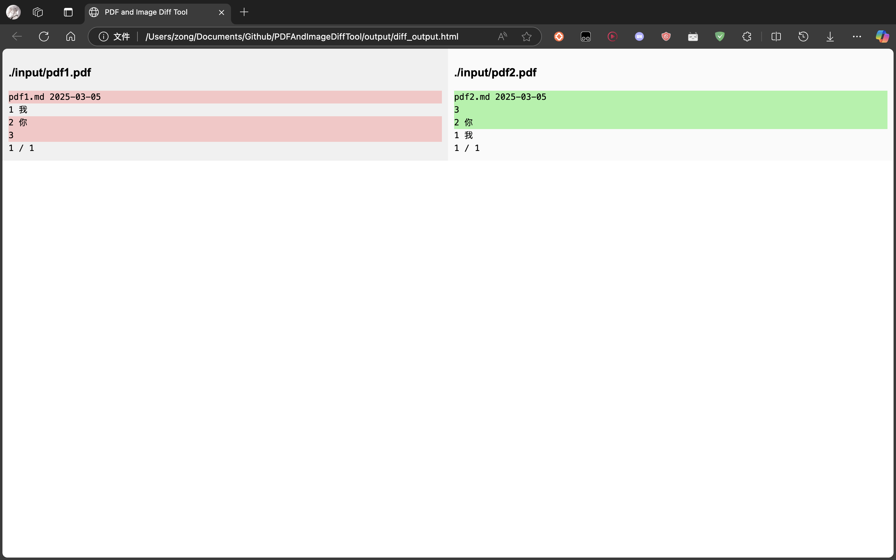

# PDF and Image Diff Tool

This tool is designed to compare the text content of two PDF files or images and generate an HTML file that displays the differences in a format similar to VSCode's Git Diff view.



## Features

* Extract text from PDF files.
* Extract text from images (using Tesseract OCR).
* Compare two text contents and generate a diff result.
* Output the diff result in HTML format with highlighted additions, deletions, and unchanged content.
* Automatically open the generated HTML file.

## Dependencies

* Python 3.x
* pdfplumber library
* pytesseract library
* Pillow library
* Tesseract OCR engine

## Installation

1. Install Python 3.x(recommended version: Python 3.9).
2. Install the required Python libraries:
```bash
pip install -r requirements.txt
```
3. Install the Tesseract OCR engine:
    * macOS:
    ```bash
    brew install tesseract
    ```
    * Linux:
    ```bash
    sudo apt-get install tesseract-ocr
    ```
    * Windows:
    Download and install the Tesseract OCR engine from [Tesseract OCR for Windows]

## Usage

1. Prepare the two files (PDFs or images) you want to compare.
2. If you want to compare images, ensure set the Tesseract OCR engine path and language in the compare.py file.
3. Run the following command in the terminal:
```bash
python compare.py <file1> <file2>
```
Replace `<file1>` and `<file2>` with the paths to the files you want to compare.
4. The program will generate an HTML file output/diff_output.html and automatically open it in your default browser.

## Examples

Compare two PDF files:

```bash
python compare.py ./input/pdf1.pdf ./input/pdf2.pdf
```
Compare a PDF file and an image:

```bash
python compare.py ./input/pdf1.pdf ./input/pdf2.png
```

## Output

The generated HTML file will display the text content of the two files side by side, with differences highlighted:

* Green: Added content.
* Red: Deleted content.
* White: Unchanged content.

## Notes

* If comparing image files, ensure the text in the images is clear to improve OCR accuracy.
* The generated HTML file will be saved at output/diff_output.html.

## License

This project is licensed under the MIT License. See the LICENSE file for details.

## Contributing

Feel free to submit issues and pull requests. Contributions are welcome!
